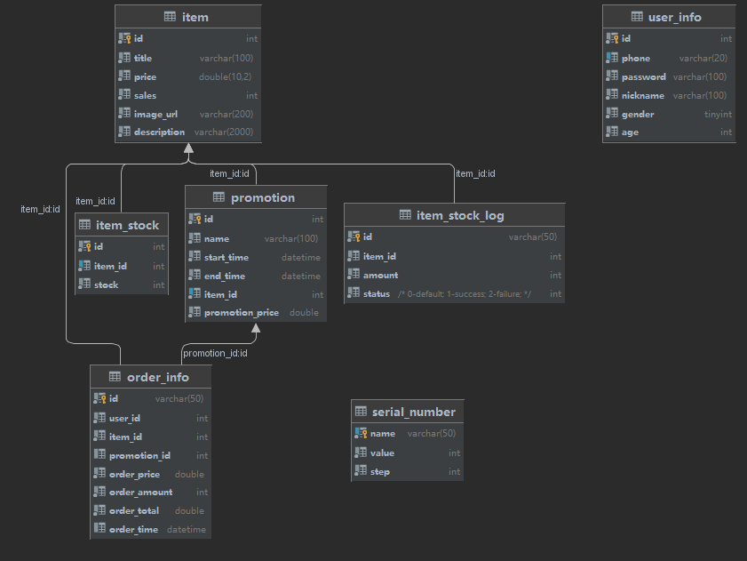

# Store

介绍：高并发优化策略实践

### 当前流程图概要

+ v2:2023.3.8

+ v1:2023.2.24

### 数据库表：

+ v1：参考自开源代码，暂未修改

1. item：商品表

2. item_stock: 商品库存表

3. promotion:活动表，维护活动价格，开始时间，结束时

4. order_info:订单表

5. serial_number：订单号表，维护订单号和步长

6. item_stock_log: 订单流水，用于MQ事务型消息中两阶段提交的验证条件，id为雪花算法生成

7. user_info：用户信息表

### TODO：

- [ ] 解决链接暴露问题：计划采用redis+UUID实现URL动态化
- [ ] 实现缓存主动更新、定时更新等策略
- [ ] 学习下Redis分布式锁
- [ ] 针对读多写少情况，实现Redis集群支撑高可用
- [ ] 再学习其他优化策略