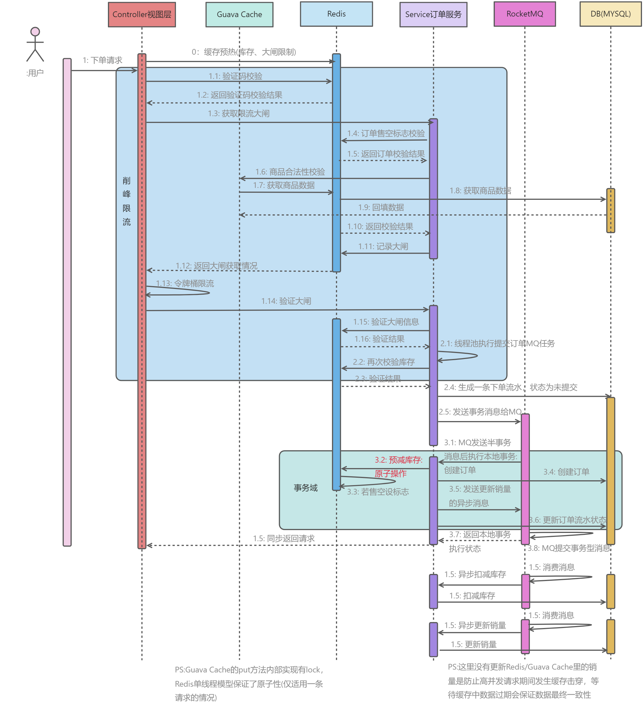
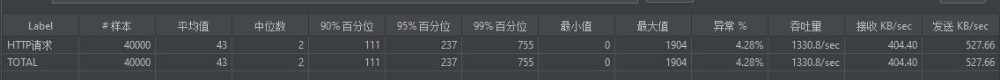
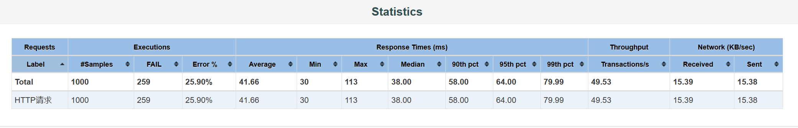
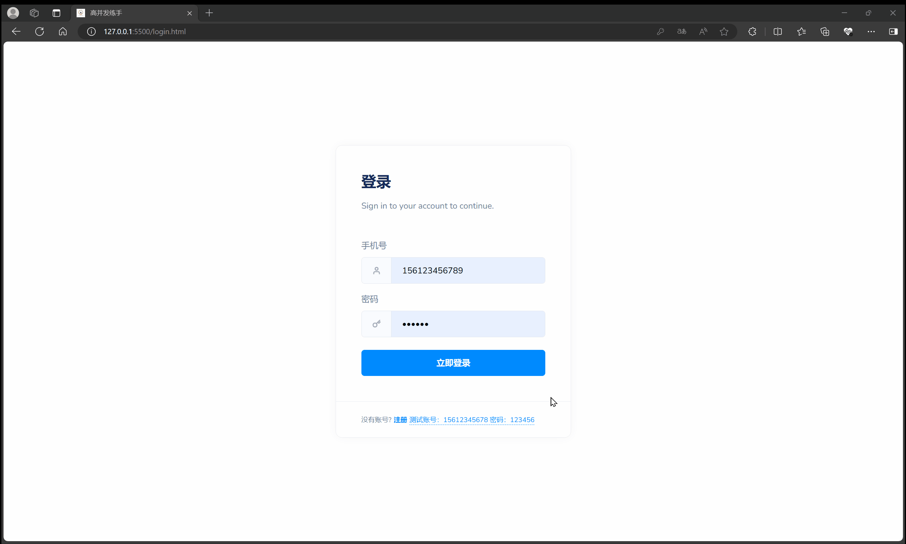

# Store

介绍：高并发优化策略实践

预览网址：[web](123.56.181.x)

### 流程的时序图

+ v2:[2023.3.8]

​	

+ v1:[2023.2.24]

  

### 数据库表：

+ v1：参考自开源代码，暂未修改

1. item：商品表

2. item_stock: 商品库存表

3. promotion:活动表，维护活动价格，开始时间，结束时

4. order_info:订单表

5. serial_number：订单号表，维护订单号和步长

6. item_stock_log: 订单流水，用于MQ事务型消息中两阶段提交的验证条件，id为雪花算法生成

7. user_info：用户信息表

### 压测：

v2:本地测试轻松过千，1核2G服务器能部署上rocketMQ+redis+mysql+nginx就好了，没必要压了

------

v1:仅msyql(1核2G内存40G存储服务器,TPS最高80)，失败率高应该是德鲁伊线程池开小了吧

### TODO：

- [x] 解决链接暴露问题：采用redis+UUID实现URL动态化
  + update：引入大闸限流，直接用这里的UUID替代大闸的token
  + update：好像用雪花算法更好，更能避免冲突，把雪花算法长度缩短后使用
- [x] 引入布隆过滤器过滤订单请求防止缓存穿透
  + todo：当前使用Guava内布隆过滤器实现，但是因为没有持久化，重新启动需要重新写入;[持久化实现方法参考]([布隆过滤器bloomfilter结合redis实现持久化且支持周期性重置_redis布隆过滤器 实现 刷新 重置-CSDN博客](https://blog.csdn.net/qq_38294335/article/details/108080455))
  + 也可以采用Redisson或Redis的bitmaps实现，需要再看一下[如何计算错误率]([Bloom filter - Wikipedia](https://en.wikipedia.org/wiki/Bloom_filter))
- [x] @PostConstruct 注解来实现启动时缓存预热和布隆过滤器写入 [实现方法参考]([面试官：SpringBoot如何实现缓存预热？ - 磊哥|www.javacn.site - 博客园 (cnblogs.com)](https://www.cnblogs.com/vipstone/p/17974747))
- [ ] 订单ID修改为雪花算法实现
- [ ] 学习下Redis分布式锁
- [ ] 针对读多写少的特点，实现Redis集群支撑高可用
- [ ] 学习实践其他优化策略
- [ ] 静态资源使用MinIO或者阿里OSS对象存储(其实用JD的OSS也挺好

------

### seckill预览

### 参考

[TaXueWWL/seckill-rocketmq: seckill-rocketmq-基于RocketMQ-电商高并发场景实战 (github.com)](https://github.com/TaXueWWL/seckill-rocketmq)

。。。

